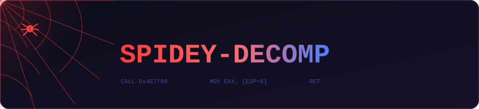

  

<h1 align="center">Spidey Decomp</h1>

Your friendly neighborhood decompilation project. Turning a 2000s Spider-Man PC game back into readable source code, one function at a time.

  
  
  
  
  
  

---

## Hey there. Yeah, you. Come here often

So, funny story. Somewhere out there is a compiled, twenty five year old copy of a PC game starring yours truly, and nobody has been able to read its source code for a very long time. That is basically me getting webbed up and stuck to a wall. Somebody had to cut me loose.

That somebody is this project. We are decompiling **Spider-Man (2000)** for PC, the Neversoft classic ported by LTI Gray Matter, straight back into clean, buildable C++ source code. And we are not just going for "close enough, ship it." We want a true matching decompilation, source that compiles down to the exact same machine code as the original game, byte for byte. No half measures. My aunt raised me better than that.

## Whose web is this anyway

This repository swings in on the shoulders of **[krystalgamer/spidey-decomp](https://github.com/krystalgamer/spidey-decomp)**, the original project and the person who started the whole rescue mission. This is a fork. All credit for the vision, the tooling, and the reverse engineering groundwork belongs there. Seriously, go star it, they earned it, I did not just say that because they can see my source code now.

## So what am I doing over here

Around here, I get a little extra help. This fork pushes the decompilation forward with AI coding agents doing a lot of the late night function matching, picking a function apart, rebuilding it from scratch, and checking it byte by byte against the original game until it lines up exactly, all under close supervision, because even a genius intern needs a mentor. Whatever comes out solid gets sent back upstream as a pull request, because sharing is caring, and also because credit belongs where the work started.

## Why bother

Because a twenty five year old web slinger deserves readable source code too. Every function that matches is one more piece of gaming history rescued, understood, and put back where people can actually learn from it. Call it my responsibility. Great power, remember?

## How is it going

In waves, mostly. Functions get picked up, decompiled, checked against the original binary, and merged in when they hold up. Some match on the first swing. Some take a dozen tries and a faceful of webbing before they finally click. Some are still stuck to a wall somewhere, waiting their turn. Slow, careful work, but it never really stops. Neither do I.

## Hall of fame

- **[krystalgamer](https://github.com/krystalgamer)**, for starting and leading the original spidey-decomp project. The real hero of this story.
- Everyone who has pitched in matches, tools, and reverse engineering notes upstream.
- The AI agents pulling the late night shifts around here. No coffee breaks, no complaints, just results.

## Want to swing in and help

Head over to the [original project](https://github.com/krystalgamer/spidey-decomp) to get involved, check open issues, or just watch the progress roll in. The more of us on this, the faster this old game gets its story told right.
